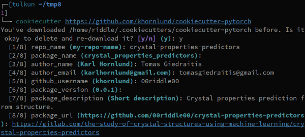

=============================
crystal-properties-predictors
=============================

.. image:: https://img.shields.io/badge/built_with-Cookiecutter_Pytorch-ee4c2c?logo=cookiecutter&link=https%3A%2F%2Fgithub.com%2Fkhornlund%2Fcookiecutter-pytorch
   :alt: Static Badge

.. image:: https://img.shields.io/badge/code%20style-black-000000.svg
   :alt: Static Badge

This project was initially setup with `Cookiecutter <https://github.com/cookiecutter/cookiecutter/>`_ using these
choices (the image below):

.. contents:: Table of Contents
   :depth: 2

Folder Structure
================

::

  crystal-properties-predictors/
  │
  ├── crystal_properties_predictors/
  │    │
  │    ├── cli.py - command line interface
  │    ├── main.py - main script to start train/test
  │    │
  │    ├── base/ - abstract base classes
  │    │   ├── base_data_loader.py - abstract base class for data loaders
  │    │   ├── base_model.py - abstract base class for models
  │    │   └── base_trainer.py - abstract base class for trainers
  │    │
  │    ├── data_loader/ - anything about data loading goes here
  │    │   ├── augmentation.py
  │    │   └── data_loaders.py
  │    │
  │    ├── model/ - models, losses, and metrics
  │    │   ├── loss.py
  │    │   ├── metric.py
  │    │   └── model.py
  │    │
  │    ├── trainer/ - trainers
  │    │   └── trainer.py
  │    │
  │    └── utils/
  │        ├── logger.py - class for train logging
  │        ├── visualization.py - class for Tensorboard visualization support
  │        └── saving.py - manages pathing for saving models + logs
  │
  ├── logging.yml - logging configuration
  │
  ├── data/ - directory for storing input data
  │
  ├── experiments/ - directory for storing configuration files
  │
  ├── saved/ - directory for checkpoints and logs
  │
  └── tests/ - tests folder

Usage
=====

.. code-block::

  $ conda env create --file environment.yml
  $ conda activate crystal_properties_predictors

The code in this repo is an MNIST example of the template. You can run the tests,
and the example project using:

.. code-block::

  $ pytest tests
  $ crystal_properties_predictors train -c experiments/config.yml

Config file format
------------------
Config files are in `.yml` format:

.. code-block:: HTML

  name: Mnist_LeNet
  n_gpu: 1
  save_dir: saved/
  seed: 1234

  arch:
    type: MnistModel
    args: {}

  data_loader:
    type: MnistDataLoader
    args:
      batch_size: 128
      data_dir: data/
      num_workers: 2
      shuffle: true
      validation_split: 0.1

  loss: nll_loss

  lr_scheduler:
    type: StepLR
    args:
      gamma: 0.1
      step_size: 50

  metrics:
  - my_metric
  - my_metric2

  optimizer:
    type: Adam
    args:
      lr: 0.001
      weight_decay: 0

  training:
    early_stop: 10
    epochs: 100
    monitor: min val_loss
    save_period: 1
    tensorboard: true

  testing:
    data_dir: data/
    batch_size: 128
    num_workers: 8

Add additional configurations if you need.

Using config files
------------------
Modify the configurations in `.yml` config files, then run:

.. code-block::

  $ crystal_properties_predictors train -c experiments/config.yml

Resuming from checkpoints
-------------------------
You can resume from a previously saved checkpoint by:

.. code-block::

  crystal_properties_predictors train -c experiments/config.yml -r path/to/checkpoint

Checkpoints
-----------
You can specify the name of the training session in config files:

.. code-block:: HTML

  "name": "MNIST_LeNet"

The checkpoints will be saved in `save_dir/name/timestamp/checkpoint_epoch_n`, with timestamp in
mmdd_HHMMSS format.

A copy of config file will be saved in the same folder.

**Note**: checkpoints contain:

.. code-block:: python

  checkpoint = {
    'arch': arch,
    'epoch': epoch,
    'state_dict': self.model.state_dict(),
    'optimizer': self.optimizer.state_dict(),
    'monitor_best': self.mnt_best,
    'config': self.config
  }

Tensorboard Visualization
--------------------------
This template supports `<https://pytorch.org/docs/stable/tensorboard.html>`_ visualization.

1. Run training

    Set `tensorboard` option in config file true.

2. Open tensorboard server

    Type `tensorboard --logdir saved/runs/` at the project root, then server will open at
    `http://localhost:6006`

By default, values of loss and metrics specified in config file, input images, and histogram of
model parameters will be logged. If you need more visualizations, use `add_scalar('tag', data)`,
`add_image('tag', image)`, etc in the `trainer._train_epoch` method. `add_something()` methods in
this template are basically wrappers for those of `tensorboard.SummaryWriter` module.

**Note**: You don't have to specify current steps, since `TensorboardWriter` class defined at
`logger/visualization.py` will track current steps.

Acknowledgments
===============
This project was created using
`Cookiecutter PyTorch <https://github.com/khornlund/cookiecutter-pytorch>`_
